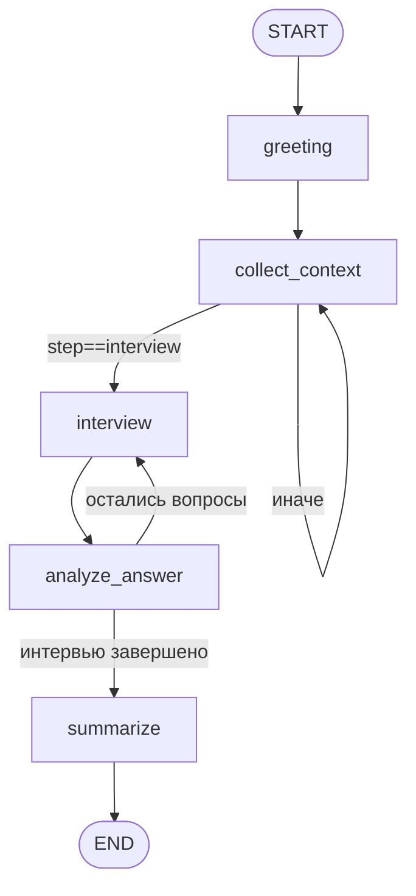

# Sokrat — справка для презентации хакатона

> AI-тренажёр для подготовки к собеседованиям
> Python 3.12 · LangGraph · Chainlit · OpenRouter (Claude Sonnet 4)

> **Важный контекст:** в репозитории два слоя — LangGraph-граф в `sokrat/` и работающее Chainlit-приложение `app.py`. Граф полностью реализован, но фронтенд его пока не вызывает напрямую (использует только отдельные функции). Это ключевая «честная» деталь для защиты — отметил в разделе «Что реально работает».

---

## 1. Архитектура графа

### 1.1. Узлы LangGraph ([sokrat/graph.py](sokrat/graph.py))

| Имя узла в графе | Функция | Файл |
|---|---|---|
| `greeting` | `greeting_node` | [sokrat/nodes/greeting.py](sokrat/nodes/greeting.py) |
| `collect_context` | `collect_context_node` | [sokrat/nodes/collect_context.py](sokrat/nodes/collect_context.py) |
| `interview` | `interview_node` | [sokrat/nodes/interview.py](sokrat/nodes/interview.py) |
| `analyze_answer` | `analyze_answer_node` | [sokrat/nodes/analyzer.py](sokrat/nodes/analyzer.py) |
| `summarize` | `summary_node` | [sokrat/nodes/summary.py](sokrat/nodes/summary.py) |

**Entry point:** `greeting`
**Checkpointer:** `MemorySaver` (in-memory)
**Interrupt before:** `collect_context`, `analyze_answer` — граф приостанавливается, чтобы получить пользовательский ввод.

### 1.2. Переходы

| Из | В | Тип | Условие |
|---|---|---|---|
| `greeting` | `collect_context` | безусловный | — |
| `collect_context` | `interview` | условный | `state["current_step"] == "interview"` (контекст распознан полностью) |
| `collect_context` | `collect_context` | условный | иначе (петля — не хватает поля) |
| `interview` | `analyze_answer` | безусловный | — |
| `analyze_answer` | `interview` | условный | `current_step == "interview"` (вопросы остались) |
| `analyze_answer` | `summarize` | условный | `current_step == "summary"` (`len(answers) >= questions_total`) |
| `summarize` | `END` | безусловный | — |

### 1.3. Mermaid-диаграмма



### 1.4. State ([sokrat/state.py](sokrat/state.py))

`InterviewState` — `TypedDict` со следующими полями:

| Поле | Тип | Обяз. | Назначение |
|---|---|---|---|
| `session_id` | `str` | да | Уникальный ID сессии |
| `started_at` | `str` (ISO-8601, UTC) | да | Время начала |
| `finished_at` | `str` | нет | Время завершения |
| `role` | `str` | нет | backend/frontend/data_engineer/ml_engineer/qa |
| `level` | `Literal["junior","middle","senior"]` | нет | Уровень |
| `interview_type` | `Literal["technical","hr","mixed"]` | нет | Тип интервью |
| `user_input` | `str` | нет | Последний ввод пользователя (volatile) |
| `assistant_output` | `str` | нет | Последний ответ ассистента (volatile) |
| `questions_asked` | `list[str]` | да | История заданных вопросов |
| `answers` | `list[Answer]` | да | Структурированные ответы с оценками |
| `current_question` | `str` | нет | Текущий вопрос (volatile) |
| `current_step` | `StepName` | да | Маркер маршрутизации |
| `questions_total` | `int` | да | План по числу вопросов (по умолчанию 7) |
| `summary` | `str` | нет | Markdown-отчёт от LLM |
| `overall_score` | `float` | нет | Средний балл |
| `errors` | `list[str]` | да | Лог ошибок узлов |

`Answer = {question, answer, score:int, strengths:list[str], weaknesses:list[str], feedback:str, category:str}`

---

## 2. Стек и зависимости

### 2.1. requirements.txt (точные пины)

```
python-dotenv>=1.0.0,<2.0.0
langgraph>=0.1.0,<0.4.0
langchain-openai>=0.1.0,<0.4.0
langchain-core>=0.2.0,<0.4.0
pydantic>=2.6.0,<3.0.0
typing-extensions>=4.10.0
chainlit>=2.0.0
```

### 2.2. Что и зачем

| Библиотека | Зачем используется |
|---|---|
| **langgraph** | `StateGraph` диалога, `MemorySaver`-чекпойнтер, `interrupt_before` для приостановки на пользовательском вводе |
| **langchain-openai** | `ChatOpenAI` как клиент для OpenRouter (он совместим с OpenAI API) — кастомный `base_url` |
| **langchain-core** | `HumanMessage` / `SystemMessage`, `with_structured_output(method="json_mode")` для строгого JSON от модели |
| **pydantic** | `AnswerEvaluation` BaseModel с валидацией (score 1–10, списки, intent, category) |
| **chainlit** | UI: чат, `cl.Action` (кнопки выбора роли/уровня/типа), `cl.Step` (видимые шаги «Анализ ответа»/«Генерация отчёта»), `cl.user_session` (состояние) |
| **python-dotenv** | Загрузка `.env` (API-ключ, base_url, имя модели, число вопросов) |
| **typing-extensions** | `NotRequired` для опциональных полей `TypedDict` |

**Модель:** `anthropic/claude-sonnet-4` через OpenRouter (`https://openrouter.ai/api/v1`), задаётся в `.env`, не хардкодится.

---

## 3. Структура проекта

```
SokaratAI/
├── app.py                          # Chainlit-приложение (точка входа, ~780 строк)
├── chainlit.md                     # Welcome-экран Chainlit
├── requirements.txt
├── README.md
├── DEVELOPER_GUIDE.md              # Архитектурный гайд (ТЗ хакатона + стек)
├── .env / .env.example             # OpenRouter ключи и параметры
│
├── sokrat/                         # LangGraph-ядро (изолированный пакет)
│   ├── __init__.py                 # Ленивый импорт build_graph
│   ├── graph.py                    # StateGraph — узлы и условные переходы
│   ├── state.py                    # InterviewState (TypedDict) + Answer
│   ├── config.py                   # Settings + пути (PROMPTS_DIR, SESSIONS_DIR…)
│   ├── llm.py                      # get_chat_model() + extract_text() для Anthropic-блоков
│   ├── storage.py                  # save_session() (atomic write) + fallback-вопросы
│   ├── question_generator.py       # LLM-генерация новых вопросов в JSON-массив
│   │
│   ├── nodes/
│   │   ├── greeting.py             # Инициализирует state, отдаёт приветствие
│   │   ├── collect_context.py      # Парсит «middle backend technical» → role/level/type
│   │   ├── interview.py            # Просит у LLM следующий вопрос (с историей)
│   │   ├── analyzer.py             # Структурированная оценка ответа (Pydantic)
│   │   └── summary.py              # Финальный markdown-отчёт + save_session
│   │
│   ├── prompts/
│   │   ├── __init__.py             # load_prompt() с lru_cache
│   │   ├── interviewer.txt         # Промпт для генерации вопроса
│   │   ├── analyzer.txt            # Богатый промпт с intents/scale/категориями
│   │   ├── summary.txt             # Шаблон отчёта (Markdown-секции)
│   │   └── question_generator.txt  # Генератор пополнения банка
│   │
│   ├── utils/
│   │   ├── validators.py           # Синонимы ролей/уровней/типов на ru/en + parse_context
│   │   └── errors.py               # Компактный format_error() для лога
│   │
│   └── data/                       # Дублирующий банк, используется графом
│       ├── questions.json          # 5 ролей × 3 уровня × 3 типа = 45 веток × 5 = 225 вопросов
│       └── sessions/.gitkeep
│
├── data/                           # Банк и сессии, используются app.py
│   ├── questions.json              # 3 роли × 3 уровня × 3 типа × 7 = 189 вопросов
│   └── sessions/                   # Сохранённые JSON-сессии (в .gitignore)
│
├── agents/, commands/              # .claude-конфиги (не часть рантайма)
└── .chainlit/                      # UI-настройки Chainlit
```

---

## 4. Что реально работает

### 4.1. End-to-end сценарий (через `chainlit run app.py`)

1. **Старт:** приветствие + кнопки выбора роли (Python Developer / Frontend Developer / Product Manager).
2. **Выбор роли → уровня → типа** через `cl.Action`-кнопки (без ручного ввода).
3. **Загрузка 7 вопросов** из `data/questions.json` (с fallback-набором, если в банке недобор).
4. **Цикл из 7 итераций:**
   - бот задаёт вопрос (с тегом типа интервью);
   - пользователь пишет ответ;
   - `cl.Step` «Анализ ответа» → LLM-вызов (`analyze_answer_llm`) с `with_structured_output(json_mode)` → Pydantic-валидация;
   - роутинг по `intent`: `answer / clarification / dont_know / skip / meta`;
   - мгновенный фидбэк с эмодзи-вердиктом и баллом.
5. **Параллельно** в фоне (`asyncio.create_task`) идёт `_enrich_bank_async` — LLM генерирует ещё 2 вопроса для этой ветки и **атомарно дописывает** их в `data/questions.json` (`os.replace` через `.tmp` + `fsync`, под `threading.Lock`).
6. **Завершение:** `_finish_interview` → агрегированный markdown-отчёт (avg_score, verdict Strong/Competent/Needs Work, сильные стороны, зоны роста, по-вопросный разбор, рекомендация) → сохранение в `data/sessions/<uuid>.json` → кнопка «Начать новое интервью».

### 4.2. Статус по узлам

| Узел / функция | Статус | Где реально вызывается |
|---|---|---|
| `greeting_node` (граф) | реализован | граф (UI не вызывает) |
| `collect_context_node` (граф) | реализован, парсит русские/английские синонимы | граф (UI не вызывает) |
| `interview_node` (граф) | реализован, с fallback на банк | граф (UI не вызывает) |
| `analyze_answer_node` (граф) | реализован | граф (UI не вызывает) |
| `summary_node` (граф) | реализован, LLM-генерация отчёта | граф (UI не вызывает) |
| `analyze_answer_llm` ([app.py:216](app.py#L216)) | **продакшен**, расширенная версия с `intent` | вызывается из Chainlit-флоу |
| `mock_generate_summary` ([app.py:261](app.py#L261)) | **mock**, без LLM — считает avg/verdict по правилам | используется для итогового отчёта |
| `generate_questions` ([sokrat/question_generator.py](sokrat/question_generator.py)) | реализован | вызывается из `_enrich_bank_async` |
| `save_session` (граф) | реализован, atomic write | используется графом |
| `save_session` ([app.py:313](app.py#L313)) | реализован, простой `json.dump` | используется UI |

> ⚠️ **Архитектурная честность для защиты:** в `app.py:256–258` есть прямой комментарий `# Mock summary (BACKEND INTEGRATION POINT)` — место, где UI должен начать дёргать `graph.ainvoke(...)` вместо локального mock-агрегатора. Граф готов, осталось его подключить к Chainlit-обработчикам вместо самописного state-machine на `cl.user_session`.

### 4.3. Закрытие требований хакатона (по [DEVELOPER_GUIDE.md](DEVELOPER_GUIDE.md))

| Требование | Реализация | Статус |
|---|---|---|
| Приветствие + объяснение возможностей | `on_chat_start` в `app.py` + `greeting_node` в графе | ✅ |
| Пошаговый диалог | `StateGraph` (готов) + явный state-machine в `cl.user_session` (используется) | ✅ |
| Валидация ввода | [sokrat/utils/validators.py](sokrat/utils/validators.py) + кнопки в UI вместо свободного ввода роли/уровня/типа | ✅ |
| Обработка некорректных запросов | `intent=clarification/dont_know/meta` + try/except + повторный запрос JSON в `analyze_answer_llm` | ✅ |
| Итоговый результат | `_finish_interview` — markdown-отчёт со средним баллом и рекомендацией | ✅ |
| Сохранение сессии | `data/sessions/<uuid>.json` + atomic write в графе | ✅ |
| Чат через Chainlit | весь UI на Chainlit | ✅ |
| **Бонус:** интерактивные элементы | `cl.Action` для выбора роли/уровня/типа, кнопка restart | ✅ |
| **Бонус:** mock-данные | `data/questions.json` (189 q) + `FALLBACK_QUESTIONS` в `app.py` | ✅ |
| **Бонус:** fallback при ошибке API | при ошибке LLM в `interview_node` → берётся вопрос из банка | ✅ |
| **Сверх ТЗ:** автопополнение банка | `generate_questions` дописывает по 2 вопроса в банк после каждой сессии | ✅ |

---

## 5. Технические решения и сложности

### 5.1. Над чем больше всего итераций (по git log)

Всего 12 коммитов от 25 апреля 2026, два feature-бранча (frontend + backend) → main:

1. **`a0d90a3` (+1994 строк)** — фронтенд MVP: Chainlit-приложение целиком (`app.py` 571 строка), банк из 1216 строк JSON, гайд.
2. **`2f97ce7` (+1299 строк)** — бэкенд: LangGraph-граф, узлы, валидаторы, промпты, второй банк вопросов.
3. **`33b9ed3` «правки»** — самый большой коммит после слияния: настройка Claude-агентов и слотов; в `app.py` +32 строки.
4. **`6302417` «добавил аналитику ответа» (+312/−117 в `app.py`, +107/−31 в `analyzer.txt`)** — самая большая итерация по бизнес-логике: расширение анализатора до системы намерений (intent: answer/clarification/dont_know/skip/meta), пересмотр шкалы оценки и фидбэка.
5. **`de0b4ae` «автопополнение вопросов»** — последняя фича: фоновая генерация новых вопросов в банк (`question_generator.py` + `_enrich_bank_async` + atomic-write с локом).

**Где было сложнее всего:** анализатор ответов — переписывался дважды, вырос с 31 до 107 строк промпта. Это видно по тому, что в коммите `6302417` промпт `analyzer.txt` практически переписали с нуля.

### 5.2. Нетривиальная логика

| Где | Что решено | Как |
|---|---|---|
| [sokrat/graph.py:36-48](sokrat/graph.py#L36-L48) | **Условные edge** в LangGraph | Два роутера-функции читают `state["current_step"]` и возвращают имя следующего узла; маппинг через словарь `{"interview": "interview", ...}` |
| [sokrat/graph.py:54](sokrat/graph.py#L54) | **Прерывание графа на ввод пользователя** | `interrupt_before=["collect_context", "analyze_answer"]` — граф останавливается перед узлами, ожидающими `user_input`, что позволяет внешнему фронтенду прокачивать UI |
| [sokrat/utils/validators.py:37-64](sokrat/utils/validators.py#L37-L64) | **Парсинг свободной фразы «middle backend technical»** | Двойной tie-break: побеждает самый длинный синоним (чтобы «ml» не убил «machine learning»), при равной длине — позже встречающийся в тексте (для случая «не junior, а senior») |
| [sokrat/llm.py:28-47](sokrat/llm.py#L28-L47) | **Совместимость с Anthropic через OpenRouter** | `extract_text` нормализует ответ: OpenAI-совместимые провайдеры дают `str`, Anthropic — `list[{type:"text", text:"..."}]`. Без этого `.strip()` падал бы |
| [sokrat/nodes/analyzer.py:46-62](sokrat/nodes/analyzer.py#L46-L62) и [app.py:240-253](app.py#L240-L253) | **Гарантированный валидный JSON от LLM** | `with_structured_output(AnswerEvaluation, method="json_mode")` + `try/except (ValidationError, ValueError)` → повторная попытка с жёстким `SystemMessage` «верни строго валидный JSON, без markdown» |
| [sokrat/question_generator.py:25-40](sokrat/question_generator.py#L25-L40) | **Парсинг массива JSON из ответа модели** | Срезаем ` ```json `-обёртки, регуляркой ловим `[...]`, дедуп по нормализованному тексту вопроса (lowercase + collapse whitespace + strip пунктуации) |
| [app.py:144-165](app.py#L144-L165) и [app.py:114-141](app.py#L114-L141) | **Фоновое пополнение банка без гонок** | `asyncio.create_task` после старта интервью → `asyncio.to_thread(generate_questions)` → запись в файл под `threading.Lock` через `.tmp` + `os.fsync` + `os.replace` |
| [app.py:580-601](app.py#L580-L601) | **Мульти-намеренческий роутинг ответа** | По `intent` LLM-классификации: `clarification` → счётчик уточнений (лимит 2, потом форсим answer), `dont_know` → даём шанс «подумать вслух», на повтор — фиксируем 0; `skip`/`meta` — отдельные ветки |
| [sokrat/storage.py:47-66](sokrat/storage.py#L47-L66) | **Atomic save сессии** | Пишем в `<id>.json.tmp`, `flush()` + `fsync()`, потом `os.replace`; `VOLATILE_FIELDS` исключаются из дампа, чтобы в файлах не оседали служебные поля |

### 5.3. TODO / FIXME / недоделанное

В коде **нет ни одного TODO/FIXME** в python-файлах (единственное упоминание — в `agents/code-reviewer.md`, не относится к рантайму). Но по факту есть незакрытые работы:

- **`mock_generate_summary` в `app.py:261-308`** — явный комментарий-маркер `# Mock summary (BACKEND INTEGRATION POINT)`. Должно быть заменено на `await graph.ainvoke({"node": "summary", ...})`.
- **Граф `sokrat.build_graph()` нигде не вызывается из `app.py`** — UI не использует LangGraph как оркестратор, только отдельные подсистемы (`get_chat_model`, `load_prompt`, `generate_questions`).
- **Два параллельных банка вопросов** (`data/questions.json` — 189 вопросов, для UI; `sokrat/data/questions.json` — 225 вопросов, для графа) с **разными ключами ролей** (`Python Developer` vs `backend`). Их надо унифицировать.
- **Чекпойнтер `MemorySaver`** — не персистентный, при перезапуске прерванная сессия не восстановится.
- **Валидация ввода `validate_answer`** ([sokrat/utils/validators.py:99-107](sokrat/utils/validators.py#L99-L107)) определена, но в `app.py` не вызывается.

---

## 6. Данные

### 6.1. Что в `data/`

```
data/
├── questions.json                  # Активный банк (используется app.py)
└── sessions/
    ├── afc783cf-…json              # Завершённые сессии пользователей
    └── f01e9d15-…json              # (sessions/ в .gitignore, файлы для теста)
```

### 6.2. Формат банка вопросов

```json
{
  "roles": {
    "Python Developer": {
      "Junior": {
        "technical": [
          {
            "id": "py_junior_tech_1",
            "question": "Чем отличается list от tuple в Python?...",
            "hints": ["изменяемость", "синтаксис", "хэшируемость", "производительность"],
            "ideal_keywords": ["mutable", "immutable", "tuple", "list", "..."]
          }
        ],
        "hr": ["..."], "mixed": ["..."]
      },
      "Middle": {"...": "..."}, "Senior": {"...": "..."}
    }
  }
}
```

### 6.3. Формат сохранённой сессии (`data/sessions/<uuid>.json`)

```json
{
  "session_id": "f01e9d15-…",
  "created_at": "2026-04-25T11:02:49+00:00",
  "role": "Python Developer", "level": "Middle", "interview_type": "hr",
  "summary": {
    "avg_score": 7.4, "total_score": 52, "max_possible": 70,
    "percentage": 74.3, "verdict": "Competent",
    "strengths": ["..."], "improvements": ["..."], "recommendation": "..."
  },
  "qa_pairs": [
    {
      "question_num": 1, "question_id": "py_middle_hr_1",
      "question_text": "...", "answer": "...",
      "score": 7, "verdict": "Хорошо", "feedback": "...",
      "intent": "answer", "strengths": ["..."], "weaknesses": ["..."],
      "category": "behavioral"
    }
  ]
}
```

### 6.4. Цифры по банку

| Бенк | Роли | Уровни | Типы | Вопросов на ветку | Всего |
|---|---|---|---|---|---|
| `data/questions.json` (UI) | 3 (Python Developer, Frontend Developer, Product Manager) | 3 (Junior/Middle/Senior) | 3 (technical/hr/mixed) | 7 | **189** |
| `sokrat/data/questions.json` (граф) | 5 (backend, frontend, data_engineer, ml_engineer, qa) | 3 (junior/middle/senior) | 3 (technical/hr/mixed) | 5 | **225** |

> Плюс банк постоянно растёт: после каждой завершённой сессии фоновая задача дописывает ещё **2 LLM-сгенерированных вопроса** в соответствующую ветку.

---

## TL;DR для слайда «Что показать жюри»

- **5 узлов LangGraph + 2 условных edge + interrupt_before** — соответствует ТЗ хакатона.
- **Структурированный вывод LLM через Pydantic** с автоматическим retry на невалидный JSON.
- **Мульти-намеренческий анализатор ответа** (5 intents) — выходит за рамки «оцени и дай фидбэк».
- **Фоновое самообучение банка** — каждая сессия добавляет 2 новых LLM-вопроса (atomic write под локом).
- **Fallback-цепочка**: ошибка LLM → банк → жёсткий fallback-вопрос; никогда не падаем на пользователе.
- **Гибкий парсер свободной фразы** про роль/уровень/тип с двойным tie-break и русскими синонимами.
- **OpenRouter** даёт переключение между Claude/GPT/Gemini одной строкой в `.env`.
